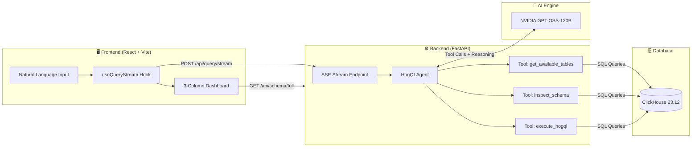

<div align="center">

# 🔍 Agentic HogQL

### Intelligent Natural Language → HogQL Query Engine

An autonomous, schema-aware AI agent that translates natural language questions into **HogQL** (PostHog's SQL dialect), executes them against **ClickHouse**, and streams results in real-time through a **high-fidelity 3-column analytics dashboard**.

<br/>

[](https://build.nvidia.com/)
[](https://clickhouse.com/)
[](https://react.dev/)
[](https://fastapi.tiangolo.com/)
[](https://docs.docker.com/compose/)
[](LICENSE)

<br/>

**Ask questions in plain English** · **Watch the AI reason in real-time** · **Get instant charts & tables**

</div>

---

## 📑 Table of Contents

- [Why Agentic HogQL?](#-why-agentic-hogql)
- [Key Features](#-key-features)
- [Architecture](#-architecture)
- [Tech Stack](#-tech-stack)
- [Quick Start](#-quick-start)
- [Project Structure](#-project-structure)
- [API Reference](#-api-reference)
- [Example Queries](#-example-queries)
- [How the Agent Works](#-how-the-agent-works)
- [Security](#-security--read-only-access)
- [Configuration](#%EF%B8%8F-configuration)
- [Development](#-development)
- [Contributing](#-contributing)
- [License](#-license)

---

## 💡 Why Agentic HogQL?

Traditional analytics dashboards require writing SQL by hand or navigating rigid point-and-click interfaces. **Agentic HogQL** bridges the gap — just ask a question in natural language, and an autonomous AI agent:

1. **Discovers** your database schema automatically
2. **Reasons** about which tables and columns to query
3. **Writes & executes** HogQL queries against ClickHouse
4. **Self-corrects** when queries fail (up to 10 iterations)
5. **Visualizes** results with auto-detected charts and tables

All of this happens in **real-time** via Server-Sent Events, with every thought and decision streamed to a terminal-style log you can watch live.

---

## ✨ Key Features

### 🖥️ Premium 3-Column Control Center

| Left Panel | Center Panel | Right Panel |
|:---:|:---:|:---:|
| Natural language input | Live **Thought Stream** (SSE) | **Final HogQL Query** |
| Interactive **Schema Browser** | Timestamped reasoning logs | **Visual Results** |
| Collapsible table/column tree | Color-coded status badges | Auto-detected charts + tables |

### 🤖 Autonomous Self-Correction

The agent doesn't just generate queries — it **validates and fixes them**. When ClickHouse returns a syntax or schema error, the agent:
- Reads the error message
- Identifies the root cause (unknown table, missing column, type mismatch)
- Generates targeted fix suggestions
- Retries with a corrected query

This loop runs for up to **10 iterations** until a successful result is obtained.

### 📊 Integrated Visual Analytics

Powered by [Recharts](https://recharts.org/), the system automatically:
- Detects numerical/temporal trends in query results
- Renders interactive **line charts** alongside raw data tables
- Supports hover tooltips, responsive sizing, and smooth animations

### 🗂️ Optimized Schema Discovery

A dedicated `/api/schema/full` endpoint fetches the **entire database hierarchy** in a single request — enabling an instant, fully interactive schema browser with table names, column names, and data types.

### 📤 Custom Data Import

Upload your own datasets for analysis:

| Feature | Detail |
|---|---|
| **Formats** | CSV, Excel (`.xlsx`, `.xls`) |
| **Auto-Inference** | Pandas-powered type detection → auto-creates ClickHouse tables |
| **Size Limit** | Up to **10 MB** per file |
| **Batch Insert** | Real-time batch insertion with progress feedback |

---

## 🏗️ Architecture



### Data Flow

```
User Question
  │
  ▼
┌─────────────────────────────────────────────────────────────┐
│  FastAPI Backend                                            │
│  ┌───────────────────────────────────────────────────────┐  │
│  │  HogQLAgent (Autonomous Loop)                        │  │
│  │                                                       │  │
│  │  Step 1 → get_available_tables()     ─── ClickHouse  │  │
│  │  Step 2 → inspect_schema(tables[])   ─── ClickHouse  │  │
│  │  Step 3 → LLM generates HogQL query  ─── NVIDIA API  │  │
│  │  Step 4 → execute_hogql(query)       ─── ClickHouse  │  │
│  │  Step 5 → On error: self-correct & retry (goto 3)    │  │
│  │  Step 6 → On success: stream final results (SSE)     │  │
│  └───────────────────────────────────────────────────────┘  │
└─────────────────────────────────────────────────────────────┘
  │
  ▼
Dashboard (Thought Log + Query + Charts + Table)
```

---

## 🛠️ Tech Stack

| Layer | Technology | Purpose |
|-------|-----------|---------|
| **LLM** | [NVIDIA NIM](https://build.nvidia.com/) `openai/gpt-oss-120b` | Reasoning, query generation, self-correction |
| **Backend** | Python 3.11 · FastAPI · Uvicorn | Async API, SSE streaming, file upload |
| **Database** | ClickHouse 23.12 | Columnar OLAP — fast analytical queries |
| **Frontend** | React 18 · Vite 6 · TypeScript | Component-based UI with hot reload |
| **Styling** | Tailwind CSS 3.4 · Framer Motion | Glassmorphism, animations, responsive design |
| **Charts** | Recharts 3.8 | Interactive line charts with auto-detection |
| **Data Engine** | Pandas 2.2 · OpenPyXL | CSV/Excel parsing, type inference |
| **Icons** | Lucide React | Consistent, lightweight icon set |
| **Infra** | Docker Compose | One-command orchestration |

---

## ⚡ Quick Start

### Prerequisites

- [Docker](https://docs.docker.com/get-docker/) & [Docker Compose](https://docs.docker.com/compose/install/)
- An **NVIDIA API Key** from [build.nvidia.com](https://build.nvidia.com/)

### 1. Clone & Configure

```bash
git clone https://github.com/NITIN9181/Agentic-Text-to-HogQL-Execution.git
cd Agentic-Text-to-HogQL-Execution
cp .env.example .env
```

Edit `.env` and add your NVIDIA API key:

```env
NVIDIA_API_KEY=nvapi-your-key-here
CLICKHOUSE_HOST=clickhouse
CLICKHOUSE_PORT=8123
CLICKHOUSE_DATABASE=posthog
```

### 2. Launch

```bash
docker-compose up --build
```

### 3. Open the Dashboard

| Service | URL |
|---------|-----|
| 🖥️ **Dashboard** | [http://localhost:5173](http://localhost:5173) |
| 📡 **API Docs** (Swagger) | [http://localhost:8000/docs](http://localhost:8000/docs) |
| 🗄️ **ClickHouse** | [http://localhost:8123](http://localhost:8123) |

> [!NOTE]
> On first launch, ClickHouse automatically seeds **10,000 events**, **200 users**, and **500 sessions** from the `init.sql` script — giving you data to query immediately.

---

## 📁 Project Structure

```
Agentic-Text-to-HogQL-Execution/
│
├── backend/
│   ├── Dockerfile
│   ├── requirements.txt
│   ├── tests/
│   └── src/
│       ├── main.py                      # FastAPI app entrypoint
│       ├── config.py                    # Pydantic settings (env vars)
│       ├── agent/
│       │   ├── executor.py              # HogQLAgent — autonomous loop with 3 tools
│       │   └── prompts.py               # System prompt with HogQL syntax rules
│       ├── database/
│       │   ├── clickhouse_executor.py   # Async ClickHouse query runner
│       │   ├── schema_inspector.py      # Table/column discovery + sampling
│       │   └── data_uploader.py         # CSV/Excel → ClickHouse pipeline
│       └── api/
│           └── routes.py                # SSE stream, schema, upload endpoints
│
├── frontend/
│   ├── Dockerfile
│   ├── package.json
│   ├── vite.config.ts
│   ├── tailwind.config.js
│   └── src/
│       ├── App.tsx                      # Root layout with 3-column grid
│       ├── main.tsx                     # React DOM entry
│       ├── index.css                    # Global styles & Tailwind base
│       ├── types.ts                     # Shared TypeScript interfaces
│       ├── hooks/
│       │   └── useQueryStream.ts        # SSE hook — manages multi-state stream
│       └── components/
│           ├── Layout.tsx               # Glassmorphism header & footer
│           ├── QueryInput.tsx           # Natural language input box
│           ├── SchemaBrowser.tsx         # Interactive collapsible schema tree
│           ├── ThoughtLogStream.tsx      # Terminal-style live thought log
│           ├── AgentStream.tsx          # Orchestrates SSE event rendering
│           ├── EventCard.tsx            # Individual event card (tool calls, errors)
│           ├── QueryViewer.tsx          # Syntax-highlighted HogQL display
│           ├── VisualResults.tsx        # Auto-detected Recharts visualization
│           ├── ResultsTable.tsx         # Paginated data table
│           └── ImportModal.tsx          # CSV/Excel upload modal (10MB)
│
├── docker/
│   └── clickhouse/
│       └── init.sql                     # Seed: 10K events, 200 users, 500 sessions
│
├── docker-compose.yml                   # 3-service orchestration
├── .env.example                         # Environment template
├── .gitignore
└── LICENSE                              # MIT
```

---

## 📡 API Reference

### Core Endpoints

| Method | Endpoint | Description |
|--------|----------|-------------|
| `POST` | `/api/query/stream` | Stream agent execution via SSE |
| `GET` | `/api/schema/tables` | List all tables with row counts |
| `GET` | `/api/schema/full` | Complete schema tree (tables + columns) |
| `GET` | `/api/schema/tables/{name}` | Detailed schema for a specific table |
| `POST` | `/api/data/upload` | Upload CSV/Excel file to ClickHouse |
| `DELETE` | `/api/data/tables/{name}` | Delete a custom uploaded table |
| `GET` | `/api/health` | Health check |

### SSE Event Types

The `/api/query/stream` endpoint emits the following event types:

```jsonc
// Agent starts a new iteration
{ "type": "iteration_start", "iteration": 1, "max_iterations": 10 }

// Real-time reasoning (chain-of-thought)
{ "type": "thought", "content": "Let me check available tables...", "is_delta": true }

// Agent calls a tool
{ "type": "tool_call", "tool": "inspect_schema", "input": { "table_names": ["events"] } }

// Tool returns results
{ "type": "tool_result", "tool": "inspect_schema", "result": { "status": "success", ... } }

// Query returned no data — agent will retry
{ "type": "empty_result", "query": "SELECT ...", "message": "No data returned. Refining query..." }

// Successful final result with data
{ "type": "final_result", "data": [...], "columns": [...], "rows": 42, "query": "SELECT ..." }

// Agent finished
{ "type": "completed", "message": "Query successful." }

// Error (may be recoverable)
{ "type": "error", "error": "...", "recoverable": true }
```

---

## 💬 Example Queries

Try these natural language questions in the dashboard:

| Question | What the Agent Does |
|----------|-------------------|
| *"How many events happened in the last 7 days?"* | Counts from `events` with a date filter |
| *"Show me the top 5 browsers by pageview count"* | Extracts `$browser` from JSON properties, groups & orders |
| *"What is the average session duration by day?"* | Joins `sessions`, truncates dates, computes `avg()` |
| *"Which users have the most events?"* | Groups by `person_id`, orders by `count()` desc |
| *"Show daily signup trends for the last month"* | Filters for `signup_completed`, groups by `toStartOfDay()` |
| *"Compare free vs pro plan event counts"* | Extracts `plan` from JSON, uses conditional aggregation |

---

## 🧠 How the Agent Works

The `HogQLAgent` follows an autonomous **ReAct-style loop** powered by OpenAI-compatible function calling:

```
┌──────────────────────────────────────────────┐
│                 Agent Loop                   │
│                                              │
│  1. LLM receives conversation + tool defs    │
│  2. LLM decides: call a tool or respond      │
│  3. If tool call:                            │
│     ├─ get_available_tables → list tables    │
│     ├─ inspect_schema → columns + samples    │
│     └─ execute_hogql → run query on CH       │
│  4. Tool result added to conversation        │
│  5. If query succeeded → stream results      │
│  6. If query failed → error feedback → retry │
│  7. Loop until success or max iterations     │
└──────────────────────────────────────────────┘
```

### Agent Tools

| Tool | Description |
|------|-------------|
| `get_available_tables` | Lists all tables in the database with row counts |
| `inspect_schema` | Returns column names, types, and 3 sample rows for specified tables |
| `execute_hogql` | Runs a HogQL `SELECT` query and returns results or detailed error feedback |

### Self-Correction Strategy

When a query fails, the agent receives structured error feedback with **categorized suggestions**:

| Error Type | Agent Receives |
|------------|---------------|
| `UNKNOWN_TABLE` | *"Table does not exist. Use `get_available_tables` to see valid names."* |
| `UNKNOWN_IDENTIFIER` | *"Column not found. Use `inspect_schema` to check actual column names."* |
| `SYNTAX_ERROR` | *"SQL syntax error. Check for typos, missing commas, or incorrect functions."* |
| `TYPE_MISMATCH` | *"Type mismatch. Check column types and use appropriate casting."* |

---

## 🛡️ Security & Read-Only Access

| Layer | Protection |
|-------|-----------|
| **Query Validation** | DDL/DML keywords (`DROP`, `DELETE`, `UPDATE`, `INSERT`, `ALTER`) are blocked at the tool level |
| **Read-Only Queries** | Only `SELECT` statements are allowed through `execute_hogql` |
| **Schema Validation** | Queries are verified against actual schema before execution |
| **File Size Limits** | Uploaded files are capped at **10 MB** |
| **CORS** | Configurable origin allowlist (defaults to `*` for development) |

---

## ⚙️ Configuration

All configuration is via environment variables (loaded from `.env`):

| Variable | Default | Description |
|----------|---------|-------------|
| `NVIDIA_API_KEY` | *(required)* | Your NVIDIA NIM API key |
| `CLICKHOUSE_HOST` | `clickhouse` | ClickHouse server hostname |
| `CLICKHOUSE_PORT` | `8123` | ClickHouse HTTP port |
| `CLICKHOUSE_DATABASE` | `posthog` | Target database name |
| `VITE_API_URL` | `http://localhost:8000` | Backend URL for the frontend |

---

## 🧑‍💻 Development

### Running Without Docker

**Backend:**
```bash
cd backend
python -m venv .venv
.venv/Scripts/activate        # Windows
# source .venv/bin/activate   # macOS/Linux
pip install -r requirements.txt
uvicorn src.main:app --reload --port 8000
```

**Frontend:**
```bash
cd frontend
npm install
npm run dev
```

> [!IMPORTANT]
> When running without Docker, you need a ClickHouse instance running locally or remotely. Update your `.env` accordingly.

### Running Tests

```bash
cd backend
pytest tests/ -v
```

---

## 🤝 Contributing

Contributions are welcome! Here's how to get started:

1. **Fork** the repository
2. **Create** a feature branch: `git checkout -b feature/amazing-feature`
3. **Commit** your changes: `git commit -m 'Add amazing feature'`
4. **Push** to the branch: `git push origin feature/amazing-feature`
5. **Open** a Pull Request

### Areas for Contribution

- 🎨 Additional chart types (bar, pie, scatter)
- 🔌 Support for more LLM providers (OpenAI, Anthropic, Ollama)
- 📊 Query history & saved dashboards
- 🧪 Expanded test coverage
- 📖 Documentation improvements

---

## 📄 License

This project is licensed under the **MIT License** — see the [LICENSE](LICENSE) file for details.

<div align="center">

---

Built with ❤️ by [Nitin Savio Bada](https://github.com/NITIN9181)

**⭐ Star this repo if you find it useful!**

</div>