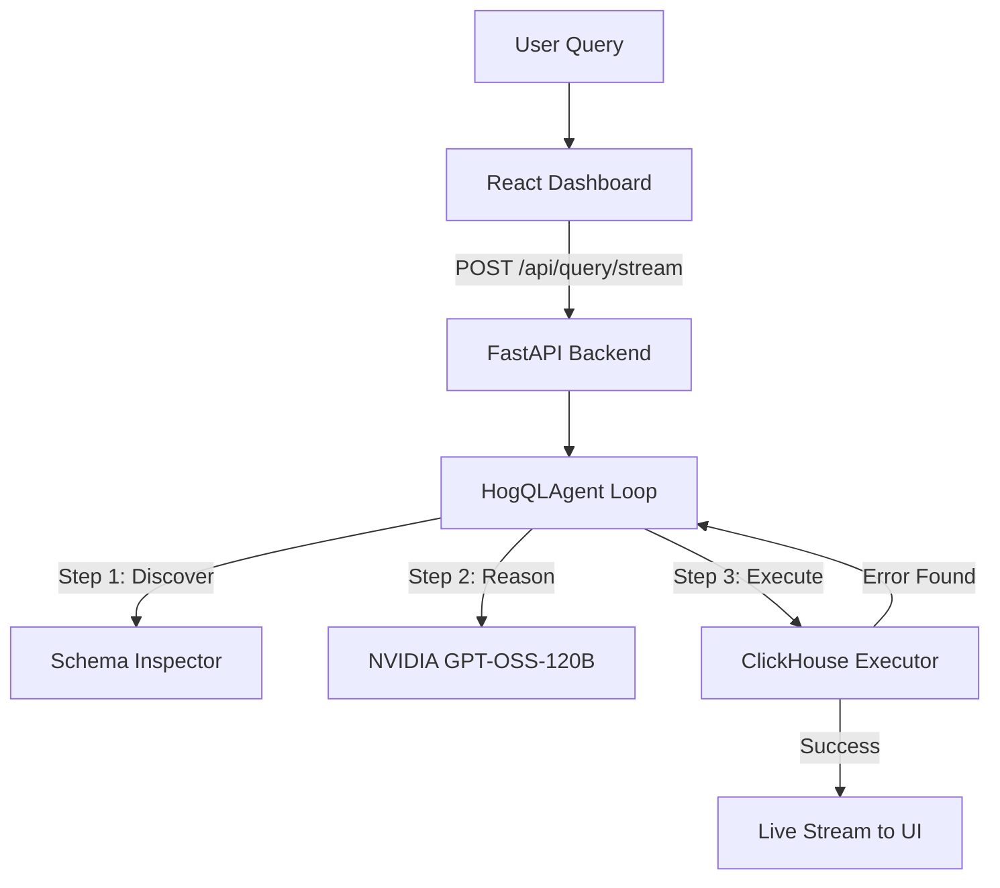

# 🔍 Agentic HogQL: Intelligent Product Analytics

> An autonomous, schema-aware AI agent that translates natural language into HogQL (PostHog's SQL), executes it against ClickHouse, and self-corrects based on real-time feedback — all streamed via a live "Chain-of-Thought" UI.


---

## 🚀 Key Features

### 1. **Autonomous Agentic Loop**
Unlike simple "text-to-SQL" scripts, this system uses a custom `while` loop orchestration (no heavy frameworks like LangChain). The agent:
- **Discovers**: Lists all available tables and calculates row counts.
- **Inspects**: Examines specific column names, data types, and 3 sample rows.
- **Refines**: If a query fails (syntax, wrong column), it reads the ClickHouse error and **self-corrects** in the next iteration.

### 2. **Live Reasoning Stream (SSE)**
Watch the agent's brain in action. Every step — including its internal **Chain-of-Thought**, tool calls, and data results — is streamed to the UI in real-time using Server-Sent Events.

### 3. **HogQL Specialized**
The system is pre-configured with the specific syntax rules and functions for PostHog's **HogQL**, ensuring accurate queries for complex time-series analytics.

### 4. **Production Data Persistence**
Includes a local ClickHouse (v23.12) instance initialized with **10,000+ mock records** (events, persons, sessions). Data is stored in a named Docker volume (`clickhouse_data`), ensuring your work persists across restarts.

### 5. **Custom Data Import (New!)**
Upload your own datasets and analyze them instantly. The system now supports:
- **Formats**: CSV and Excel (.xlsx, .xls) uploads.
- **Auto-Schema Inference**: Uses **Pandas** to detect column types (Int, Float, DateTime, String) and automatically creates the corresponding ClickHouse table.
- **Scale**: Optimized for datasets up to **10MB** with real-time indexing.

---

## 🛠️ Tech Stack

- **LLM**: NVIDIA NIM `openai/gpt-oss-120b` (Deep Reasoning)
- **Backend**: Python 3.11 + FastAPI (Asynchronous execution)
- **Database**: ClickHouse (Distributed, OLAP storage)
- **Frontend**: React 18 + Vite + Tailwind CSS (Premium Dark Mode)
- **Data Engine**: Pandas (for schema inference and cleanup)
- **Streaming**: Server-Sent Events (SSE) for low-latency feedback

---

## 📋 Architecture



---

## ⚡ Quick Start

### 1. Prerequisites
Ensure you have **Docker** and **Docker Compose** installed.

### 2. Environment Setup
Clone the repo and create your `.env` file from the example:

```bash
git clone https://github.com/NITIN9181/Agentic-Text-to-HogQL-Execution.git
cd Agentic-Text-to-HogQL-Execution
cp .env.example .env
```

Add your **NVIDIA API Key** to `.env`:
```env
NVIDIA_API_KEY=nvapi-your-secret-key
```

### 3. Launch the System
Start all services (Backend, Frontend, ClickHouse):

```bash
docker-compose up --build
```

### 4. Access the App
- **Frontend**: [http://localhost:5173](http://localhost:5173)
- **Backend API**: [http://localhost:8000/docs](http://localhost:8000/docs)
- **ClickHouse HTTP**: [http://localhost:8123](http://localhost:8123)

---

## 🔍 Example Queries to Try

- *"Show me the total number of pageview events per day for the last month."*
- *"Count the top 5 most frequent event types and their distinct user counts."*
- *"Identify the unique browsers users are using based on event properties."*
- *"Which personas have executed 'purchase' events more than 5 times?"*

---

## 🛡️ Security & Read-Only Access
The system is built with a **"Trust but Verify"** security model:
1. **Tool-Level Blocking**: The `ClickHouseExecutor` rejects any query containing DDL or DML keywords (`DROP`, `DELETE`, `INSERT`, `ALTER`, etc.).
2. **Read-Only Connection**: The backend connects as a restricted user by default.
3. **Internal Validation**: Queries are parsed and validated against the discovered schema before execution.

---

## 📄 License
MIT © [NITIN9181](https://github.com/NITIN9181)
rs for the past month" | Counts distinct users per day |
| "Which pages have the most pageviews?" | Extracts URL from properties, ranks by count |
| "Compare free vs pro user activity" | Joins events with persons, groups by plan |
| "What's the average session duration?" | Aggregates session metrics |

## Tech Stack

| Component | Technology |
|-----------|-----------|
| LLM | NVIDIA GPT-OSS-120B |
| Backend | Python 3.11, FastAPI, OpenAI SDK |
| Database | ClickHouse 23.12 |
| Frontend | React 18, TypeScript, Vite, TailwindCSS |
| Streaming | Server-Sent Events (SSE) |
| Infrastructure | Docker Compose |

## 📁 Project Structure

```
agentic-hogql/
├── docker-compose.yml          # Three-service orchestration
├── .env.example                # Environment variables template
├── docker/
│   └── clickhouse/
│       └── init.sql            # Database schema + 10K mock records
├── backend/
│   ├── Dockerfile
│   ├── requirements.txt
│   └── src/
│       ├── main.py             # FastAPI app entry point
│       ├── config.py           # Pydantic settings
│       ├── agent/
│       │   ├── executor.py     # Core agentic while-loop
│       │   └── prompts.py      # System prompt with HogQL rules
│       ├── database/
│       │   ├── clickhouse_executor.py  # Read-only query execution
│       │   ├── schema_inspector.py     # Table/column discovery
│       │   └── data_uploader.py        # NEW: CSV/Excel import logic
│       ├── api/
│       │   └── routes.py       # SSE streaming & Upload endpoints
│       └── tests/
│           ├── test_agent.py
│           └── test_clickhouse.py
└── frontend/
    ├── Dockerfile
    ├── package.json
    └── src/
        ├── App.tsx             # Root component
        ├── types.ts            # TypeScript event types
        ├── hooks/
        │   └── useQueryStream.ts   # SSE connection hook
        └── components/
            ├── Layout.tsx      # Main wrapper with Import trigger
            ├── ImportModal.tsx # NEW: Data upload modal component
            ├── QueryInput.tsx
            ├── AgentStream.tsx
            ├── EventCard.tsx
            └── ResultsTable.tsx
```

---

## 🔍 Example Queries (Custom Data)

Once you've uploaded your own CSV/Excel file, try these:
- *"What are the total sales figures in the 'uploaded_sales_data' table?"*
- *"Find the top 10 customers by revenue in our custom dataset."*
- *"Show me the monthly trend of active users from the custom table."*

---

## 📄 License

MIT © [NITIN9181](https://github.com/NITIN9181)