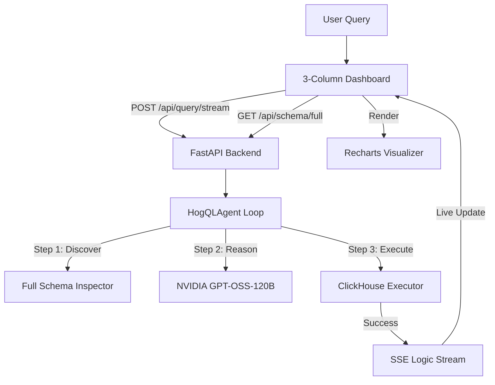

# 🔍 Agentic HogQL: Intelligent Analytics Dashboard

> An autonomous, schema-aware AI agent that translates natural language into HogQL (PostHog's SQL) and executes it against ClickHouse. Featuring a **high-fidelity 3-column control center** with live reasoning, interactive schema discovery, and automated data visualizations.


---

## 🚀 Key Features

### 1. **Premium 3-Column Control Center**
Experience analytics like never before with a high-fidelity dashboard layout:
- **Left Column**: Natural language input and an **Interactive Schema Browser** (collapsible table/column tree).
- **Middle Column**: Live **Thought Stream (SSE)** with timestamped logs, terminal-style reasoning, and color-coded status badges.
- **Right Column**: **Final HogQL Query** (syntax-highlighted) and **Visual Results** (Integrated Charts + Tables).

### 2. **Autonomous Self-Correction**
The agent handles complex analytical queries by iteratively discovering data, inspecting specific columns, and **self-correcting** when ClickHouse returns syntax or schema errors.

### 3. **Integrated Visual Analytics**
Powered by **Recharts**, the system automatically detects numerical trends in your query results and renders them as beautiful, interactive line charts alongside the raw data tables.

### 4. **Optimized Schema Discovery**
Uses a specialized `/api/schema/full` backend endpoint to fetch the entire database hierarchy in a single efficient operation, enabling a snappy and informative schema browser.

### 5. **Custom Data Import**
Seamlessly analyze your own datasets:
- **Formats**: CSV and Excel (.xlsx, .xls) support.
- **Auto-Inference**: Uses **Pandas** to detect types and create ClickHouse tables automatically.
- **Scale**: Real-time batch insertion for datasets up to **10MB**.

---

## 🛠️ Tech Stack

- **LLM**: NVIDIA NIM `openai/gpt-oss-120b` (Reasoning & Correction)
- **Backend**: Python 3.11 + FastAPI (Async streaming & Storage)
- **Database**: ClickHouse 23.12 (Distributed OLAP)
- **Frontend**: React 18, Vite, Tailwind CSS, Framer Motion, Recharts
- **Data Engine**: Pandas (Schema inference & Cleanup)

---

## 📋 Architecture



---

## ⚡ Quick Start

### 1. Environment Setup
Clone the repo and create your `.env` file:
```bash
git clone https://github.com/NITIN9181/Agentic-Text-to-HogQL-Execution.git
cd Agentic-Text-to-HogQL-Execution
cp .env.example .env
```
Add your **NVIDIA API Key** to `.env`.

### 2. Launch the System
```bash
docker-compose up --build
```
- **Frontend**: [http://localhost:5173](http://localhost:5173)
- **Backend API**: [http://localhost:8000/docs](http://localhost:8000/docs)

---

## 📁 Project Structure

```
agentic-hogql/
├── backend/
│   └── src/
│       ├── agent/
│       │   ├── executor.py         # Autonomous loop logic
│       │   └── prompts.py          # HogQL syntax rules
│       ├── database/
│       │   ├── clickhouse_executor.py
│       │   ├── schema_inspector.py # Optimized tree discovery
│       │   └── data_uploader.py
│       └── api/
│           └── routes.py           # SSE & Data endpoints
└── frontend/
    └── src/
        ├── hooks/
        │   └── useQueryStream.ts   # Multi-state stream hook
        └── components/
            ├── Layout.tsx          # Glassmorphism header/footer
            ├── QueryInput.tsx      # Stylized natural language box
            ├── SchemaBrowser.tsx   # Interactive tree component
            ├── ThoughtLogStream.tsx# Terminal-style SSE logs
            ├── QueryViewer.tsx     # Syntax-highlighted query
            ├── VisualResults.tsx   # Integrated Charts + Table
            └── ImportModal.tsx     # 10MB CSV/Excel uploader
```

---

## 🛡️ Security & Read-Only Access
- **Tool-Level Blocking**: Rejects DDL/DML keywords (`DROP`, `DELETE`, `UPDATE`).
- **Sandbox Environment**: All queries run against a read-only database user.
- **Validation**: Strict schema-aware query verification before execution.

---

## 📄 License
MIT © [NITIN9181](https://github.com/NITIN9181)